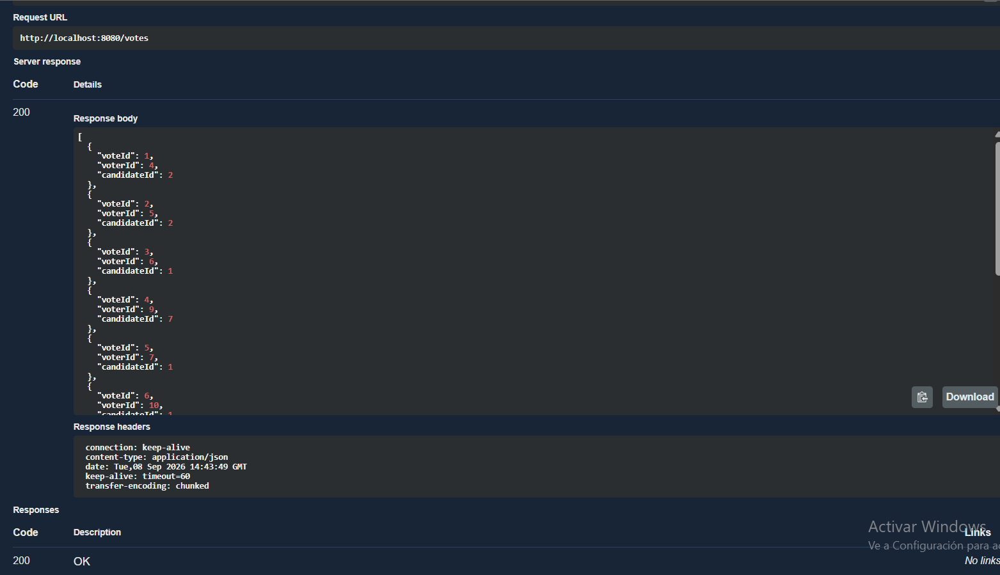
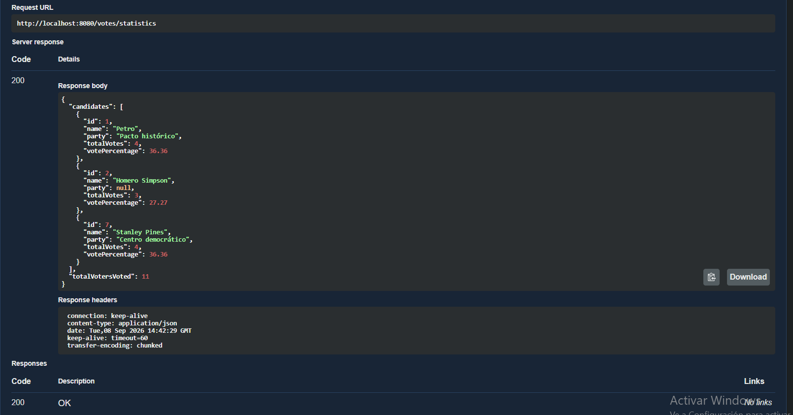

# 🗳️ Sistema de Votaciones

API RESTful desarrollada con **Java y Spring Boot** para gestionar un sistema de votaciones.

La aplicación permite registrar y administrar **votantes** y **candidatos**, gestionar la emisión de votos garantizando que cada votante pueda votar una sola vez y consultar **estadísticas de los resultados**.

El sistema incorpora validaciones y reglas de negocio para preservar la **integridad y trazabilidad de la información**, incluyendo el control de votantes que ya han votado y candidatos que ya han recibido votos.

---

## 🛠️ Tecnologías utilizadas

- ☕ **Java 17**
- 🌱 **Spring Boot 4.0.8**
- 🌐 **Spring Web MVC** — Desarrollo de la API REST
- 🗄️ **Spring Data JPA + Hibernate** — Persistencia y mapeo objeto-relacional
- 🐬 **MySQL** — Base de datos relacional
- ✅ **Spring Boot Validation** — Validación de datos de entrada
- 📖 **SpringDoc OpenAPI** — Documentación interactiva de la API con Swagger UI
- 🧩 **Lombok** — Reducción de código repetitivo
- 📦 **Maven** — Gestión de dependencias y construcción del proyecto

---

## 🏗️ Arquitectura del proyecto

El proyecto utiliza una **arquitectura por capas**, separando las responsabilidades de la aplicación para facilitar su mantenimiento, escalabilidad y organización.

```text
com.votaciones.api_votaciones
├── controller    → Endpoints REST
├── service       → Lógica de negocio
├── repository    → Acceso a datos
├── model         → Entidades JPA
├── dto           → Objetos de entrada y salida
└── exception     → Manejo centralizado de errores
```

### 📂 Responsabilidades

- 🎮 **Controller:** gestiona las solicitudes HTTP.
- 🧠 **Service:** contiene las reglas y lógica de negocio.
- 🗃️ **Repository:** gestiona la persistencia mediante JPA.
- 🧱 **Model:** representa las entidades del sistema.
- 📦 **DTO:** controla los datos de entrada y salida de la API.
- ⚠️ **Exception:** centraliza el manejo de errores y excepciones de negocio.

---

## ⚙️ Requisitos previos

Antes de ejecutar el proyecto, asegúrate de tener instalado:

- ☕ **Java 17** o superior
- 📦 **Maven 3.9+**
- 🐬 **MySQL 8.0+**
- 🔧 **Git**

También es necesario contar con una instancia de MySQL disponible para crear y utilizar la base de datos del proyecto.

---

## ⚙️ Configuración de la base de datos

El proyecto utiliza **MySQL** como sistema de gestión de base de datos y obtiene las credenciales de conexión mediante **variables de entorno**, evitando almacenar información sensible directamente en el código.

### 🔐 Variables de entorno

Antes de ejecutar la aplicación, establece las siguientes variables de entorno en PowerShell:

```powershell
$env:DB_USERNAME="root"
$env:DB_PASSWORD="tu_contraseña"
$env:DB_URL="jdbc:mysql://localhost:3306/sistema_votaciones?useSSL=false&createDatabaseIfNotExist=true&allowPublicKeyRetrieval=true&serverTimezone=UTC"
```
> 💡 Reemplaza root y tu_contraseña con las credenciales de tu instalación local de MySQL.

> 💡 La base de datos `sistema_votaciones` se crea automáticamente al iniciar la aplicación si no existe.

### 🗄️ Configuración de JPA

Hibernate utiliza `ddl-auto: update`, por lo que las tablas necesarias se crean y actualizan automáticamente a partir de las entidades JPA.

---

## ▶️ Ejecución del proyecto

Una vez configuradas las variables de entorno, ejecuta la aplicación desde la raíz del proyecto:

```powershell
.\mvnw.cmd spring-boot:run
```

La aplicación estará disponible en:
http://localhost:8080

---

## 🗳️ Votos registrados

El endpoint `GET /votes` permite consultar los votos emitidos y verificar la información almacenada para cada votación.



---
## 📊 Estadísticas de la votación

El endpoint `GET /votes/statistics` permite consultar los resultados de la votación, incluyendo el total de votos y porcentaje obtenido por cada candidato, así como el total de votantes que han emitido su voto.



---

## 📝 Consideraciones y decisiones de diseño

### 🔎 Limitación del modelo

El requisito establece que una persona no puede registrarse simultáneamente como votante y candidato. Sin embargo, el modelo proporcionado no define un identificador común entre ambas entidades (por ejemplo, número de documento), por lo que no es posible validar esta restricción de forma confiable.

No se utiliza el nombre como mecanismo de identificación, debido a que no garantiza que dos personas con el mismo nombre sean la misma persona.

### 🔐 Integridad y trazabilidad de los votos

Para preservar la integridad y trazabilidad de la información, el sistema no permite eliminar:

- Un votante que ya haya emitido un voto.
- Un candidato que ya haya recibido votos.

En ambos casos se devuelve una respuesta `409 CONFLICT` mediante excepciones de negocio específicas, evitando que se pierda información relacionada con el historial de la votación.